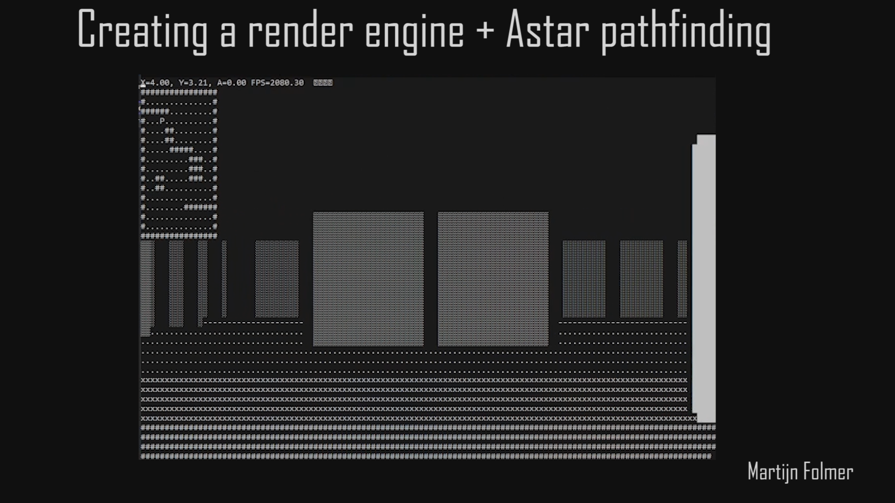

# RenderEngineCPPandAstar

We created a simple renderengine based in c++, of a room with some walls as obstacles and used the console window to show the room with ascii art. It also includes an Astar integration. The purpose of this project was purely educational interest and I highly recommend doing something like this if you are a programmer with some experience looking to increase your own c++ capabilities.

The cpp script contains two 'modes'. One where you control the robot yourself with WASD, and one where the robot tries to find a path to a goal using a version of Astar. You can choose one of these modes by setting the variable PlayerControlled to whichever you like.

Feel free to use any part of this code for any and all purposes. The Astar class and autonomous movement is fully made by me and  the render engine part of this code is heavily inspired by the algorithms shown in a video from javidx9, which can be found at the following address : https://www.youtube.com/watch?v=xW8skO7MFYw&t=82s

Some improvements that I would make if I had more time:
- Multiple robots that have to avoid eachother whilst going about their business, which requires a more dynamic pathfinding solution
- Multiple tasks and multiple robots, so the challenge becomes assigning the task in such a way that it is done in the least amount of time
- Visualisation of the path inside of the render, so you can see where the robot intends to go.
- Create a SLAM algorithm to have the robot try to find its own way
- Variable speeds, so we have to take into account the speed up and slow down of the robot
- Robots which are not omni-directional and must take turning circles into account
